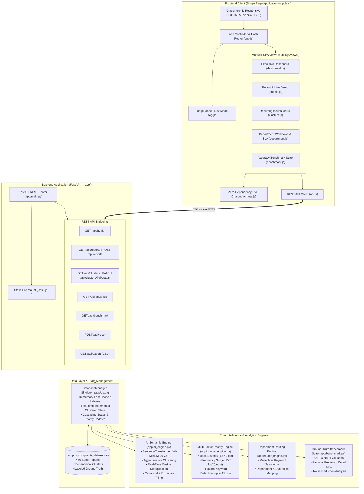
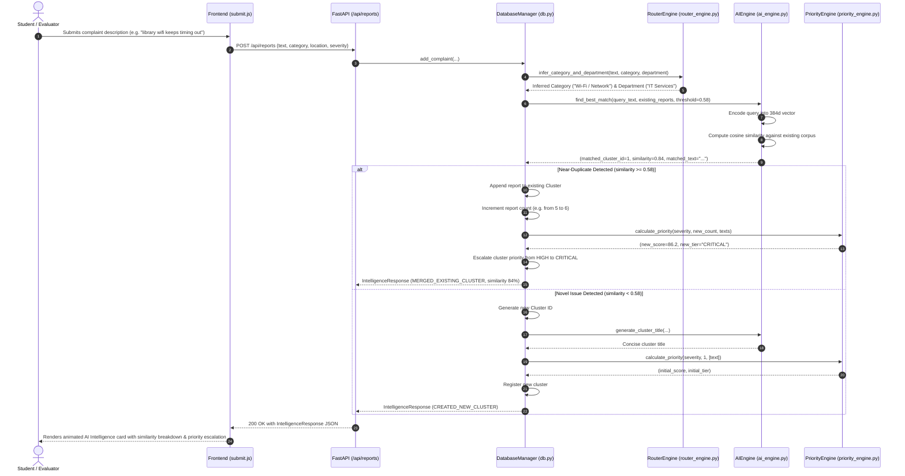

# Campus Problem Intelligence (CPI 360) — System Architecture

## 1. Executive Summary

**Campus Problem Intelligence (CPI 360)** is an autonomous campus issue intelligence, deduplication, and resolution platform developed for **Campusathon 2026 (Problem Statement 5: Campus Problem Intelligence Platform)**.

Modern university campuses suffer from "complaint fragmentation"—hundreds of students independently submit tickets for the exact same underlying problems (e.g., library Wi-Fi outage, classroom fan failure, canteen hygiene). Conventional ticketing systems treat every submission as an isolated ticket, resulting in:
- Departmental inbox overload and duplicate work
- Difficulty identifying recurring and safety-critical patterns
- Lack of holistic visibility into problem clusters and resolution SLAs

CPI 360 solves this by implementing an AI-driven pipeline that:
1. **Converts complaints into 384-dimensional dense semantic vector embeddings**
2. **Performs real-time near-duplicate detection and hierarchical problem clustering**
3. **Applies a multi-factor priority engine** (combining base severity, logarithmic frequency surge, and safety hazard keyword detection)
4. **Auto-routes issues to responsible departments** using keyword taxonomy
5. **Cascades resolution status across all linked student reports**
6. **Validates clustering precision and recall against ground-truth benchmarks**

---

## 2. High-Level Architecture Diagram



---

## 3. Detailed Component Breakdown

### 3.1 Backend Components (`app/`)

#### [`app/main.py`](file:///d:/Campus%20Hack/app/main.py) — Application Controller & Endpoints
The entry point initializes FastAPI with permissive CORS middleware, mounts static frontend assets (`/css`, `/js`), and exposes the core REST endpoints:
- `GET /api/health`: Health status, report count, cluster count, and active embedding model.
- `GET /api/reports`: Filterable query interface for raw reports (filters: `category`, `department`, `status`, `severity`, `cluster_id`, `search`).
- `POST /api/reports`: Ingestion pipeline for incoming student complaints. Returns an `IntelligenceResponse` detailing duplicate matching, similarity %, priority shifts, and actions taken.
- `GET /api/clusters`: Aggregated view of recurring and isolated problem clusters with sorting by priority score.
- `GET /api/clusters/{cluster_id}`: Deep-dive view of an individual cluster including all its constituent student reports.
- `PATCH /api/clusters/{cluster_id}/status`: Updates cluster status (`Open`, `In Progress`, `Resolved`) and resolution notes, automatically cascading down to all linked reports.
- `GET /api/analytics`: Aggregates real-time KPIs, deduplication rates, status breakdowns, timeline distributions, and department workloads.
- `GET /api/benchmark`: Computes clustering accuracy and deduplication quality metrics against the ground-truth dataset.
- `POST /api/reset`: Restores the in-memory database to the pristine 56 seed reports for live judging demonstrations.
- `GET /api/export`: Generates and downloads a CSV export of all reports with assigned cluster metadata.

#### [`app/ai_engine.py`](file:///d:/Campus%20Hack/app/ai_engine.py) — Semantic Embedding & Clustering Engine
- **Vector Embeddings**: Loads the pre-trained `all-MiniLM-L6-v2` model from `sentence-transformers`, generating 384-dimensional dense semantic vectors. Includes a Scikit-Learn TF-IDF fallback if the neural model cannot be initialized.
- **Batch Hierarchical Clustering**: Computes a pairwise cosine distance matrix and applies `AgglomerativeClustering` (average linkage) with a category divergence penalty (+0.15 distance penalty for cross-category pairs) to ensure semantic coherence.
- **Online Near-Duplicate Ingestion**:
  $$\text{adjusted\_similarity} = \text{cosine\_similarity}(v_{\text{query}}, v_{\text{candidate}}) \pm \text{category\_bias}$$
  Threshold logic matches incoming queries when $\text{effective\_similarity} \ge 0.58$ or $\text{raw\_similarity} \ge 0.62$.
- **Automated Titling**: Generates concise, executive-level cluster titles using a combination of canonical cluster titles and heuristic extractive summarization.

#### [`app/priority_engine.py`](file:///d:/Campus%20Hack/app/priority_engine.py) — Multi-Factor Dynamic Priority Engine
Determines a dynamic priority score (0–100) and classifies issues into discrete tiers:
1. **Base Severity Weight**:
   $$\text{Base} = \begin{cases} 40 & \text{High} \\ 25 & \text{Medium} \\ 12 & \text{Low} \end{cases}$$
2. **Frequency / Near-Duplicate Surge**:
   $$\text{Boost}_{\text{freq}} = \min\left(45.0,\, 15.0 \times \log_2(\text{report\_count})\right) \quad \text{for } \text{report\_count} > 1$$
3. **Safety / Hazard Keyword Presence**:
   Scans text for hazard tokens (`danger`, `shaking`, `grinding`, `injury`, `trip`, `fire`, `hazard`, `shock`, `bite`, `unhygienic`, `unsafe`), adding $+5.0$ per match up to $+15.0$.
4. **Classification Tiers**:
   - `CRITICAL`: Total Score $\ge 75$ OR (Count $\ge 5$ and Severity $\in \{\text{High}, \text{Medium}\}$)
   - `HIGH`: Total Score $\ge 50$ OR Count $\ge 3$
   - `MEDIUM`: Total Score $\ge 28$
   - `LOW`: Total Score $< 28$

#### [`app/router_engine.py`](file:///d:/Campus%20Hack/app/router_engine.py) — Category & Department Routing Engine
- **Category Inference**: Evaluates text against a keyword dictionary across 8 domains (*Wi-Fi / Network*, *Infrastructure*, *Hygiene*, *Academics*, *Sports Facilities*, *Transport*, *Safety*, *Accessibility*).
- **Department Routing**: Routes complaints to the responsible administrative department (*IT Services*, *Maintenance*, *Housekeeping*, *Security Office*, *Transport Office*, *Sports Department*).
- **Academic Sub-routing**: Distinguishes financial queries (*Accounts Office*), examination/hall ticket issues (*Examination Cell*), and curriculum/marks queries (*Academic Office*).

#### [`app/benchmark.py`](file:///d:/Campus%20Hack/app/benchmark.py) — Ground-Truth Accuracy Validation
Computes clustering and deduplication metrics by comparing model-predicted cluster assignments against true ground-truth labels (`true_cluster_id`):
- **Adjusted Rand Index (ARI)**: Chance-corrected measure of cluster agreement.
- **Normalized Mutual Information (NMI)**: Information-theoretic measure of clustering concordance.
- **Pairwise Precision, Recall, and F1-Score**: Evaluates whether real duplicate pairs were correctly grouped.
- **Homogeneity & Completeness**: Verifies cluster purity and coverage.
- **Noise Reduction %**: Quantifies administrative noise eliminated through clustering.

#### [`app/db.py`](file:///d:/Campus%20Hack/app/db.py) — In-Memory Database & State Management
- High-speed in-memory repository for reports and clusters, ensuring sub-10ms API responses.
- Implements cascading updates: resolving a cluster marks all constituent student reports as resolved.
- Implements auto-reopening: a new complaint matching a previously resolved cluster re-opens it with an audit note.
- Generates comprehensive dashboard analytics on demand.

#### [`app/models.py`](file:///d:/Campus%20Hack/app/models.py) — Pydantic Schemas
Defines strictly typed request and response data models:
- `ComplaintReport`, `ComplaintCreateRequest`
- `ClusterGroup`, `ClusterStatusUpdateRequest`
- `IntelligenceResponse`
- `BenchmarkReport`, `BenchmarkMetric`

---

### 3.2 Frontend Architecture (`public/`)

The frontend is built using **Vanilla HTML5, CSS3, and JavaScript**, structured as a modular Single Page Application (SPA) with no external framework dependencies:

```
public/
├── css/
│   └── style.css            # Dark glassmorphic design system & typography
├── js/
│   ├── api.js               # Centralized asynchronous API client
│   ├── app.js               # SPA controller, hash router, and mode manager
│   ├── charts.js            # Pure SVG charting library (area, bar, donut)
│   └── views/
│       ├── dashboard.js     # Executive KPI and analytics dashboard
│       ├── submit.js        # Student reporting & real-time demo presets
│       ├── clusters.js      # Clustered issues matrix and thread viewer
│       ├── department.js    # Department SLA and workload tracker
│       └── benchmark.js     # AI accuracy and ground-truth validation suite
└── index.html               # Main application shell and sidebar navigation
```

#### Key Frontend Capabilities:
1. **Hash Routing**: Instant navigation between views (`#dashboard`, `#submit`, `#clusters`, `#department`, `#benchmark`) without page reloads.
2. **Judge Mode vs. Dev Mode**: A topbar toggle that allows judges to view the application in production mode (clean executive view) or developer mode (exposing ground-truth IDs, test badges, and accuracy annotations).
3. **Live Demo Presets**: One-click demo buttons in `submit.js` allowing instant testing of paraphrased duplicates, safety escalations, and novel campus issues.
4. **Interactive SVG Charts**: Custom charting module (`charts.js`) that renders responsive area timeline charts, donut breakdown charts, and horizontal department load bars directly into SVG DOM elements.

---

## 4. End-to-End Complaint Ingestion Lifecycle



---

## 5. Technology Stack Summary

| Layer | Technology / Tool | Purpose |
| :--- | :--- | :--- |
| **Backend Framework** | FastAPI (Python 3.10+) | High-performance asynchronous REST API framework |
| **ASGI Server** | Uvicorn | ASGI web server implementation |
| **NLP & Embeddings** | `sentence-transformers` (`all-MiniLM-L6-v2`) | 384-dimensional dense semantic vector representations |
| **ML & Clustering** | Scikit-Learn (`AgglomerativeClustering`) | Unsupervised hierarchical clustering and metric computation |
| **Data & Numerics** | NumPy | Vector arithmetic, cosine distance matrices |
| **Data Validation** | Pydantic v2 | Strict schema typing and request/response validation |
| **Frontend UI** | HTML5, Vanilla CSS3 | Modern dark-mode glassmorphic interface |
| **Frontend Logic** | Vanilla JavaScript (ES6+) | Single-Page Application state, routing, and DOM manipulation |
| **Data Visualization**| Native SVG (`charts.js`) | Lightweight, dependency-free responsive data visualization |
| **Seed Dataset** | CSV (`campus_complaints_dataset.csv`) | 56 realistic complaints across 15 ground-truth clusters |

---

## 6. Design Decisions & Trade-Offs

1. **Sentence Transformers vs. Large Language Models (LLMs)**:
   - *Decision*: Used a local, distilled SentenceTransformer (`all-MiniLM-L6-v2`) instead of external generative LLM APIs.
   - *Rationale*: Guarantees sub-100ms inference times, zero API token costs, full offline capability, and deterministic reproducible embeddings.
2. **Hierarchical Agglomerative Clustering vs. K-Means / DBSCAN**:
   - *Decision*: Selected Agglomerative Clustering with a precomputed cosine distance threshold.
   - *Rationale*: Does not require predefining the number of clusters $k$ (unrealistic in complaint ticketing) and handles varying cluster densities better than standard DBSCAN.
3. **In-Memory Store with Seed CSV vs. Heavy SQL Database**:
   - *Decision*: In-memory singleton state manager initialized from seed CSV with live reset support.
   - *Rationale*: Ideal for hackathon demonstrations, zero external database setup requirements, and instant atomic resets between demo runs.
4. **Vanilla Frontend vs. Heavy Frameworks (React/Angular)**:
   - *Decision*: Zero-build Vanilla JS SPA with custom CSS tokens.
   - *Rationale*: Eliminates `npm install` build friction, achieves instantaneous load times, and allows direct inspection of clean modular views.
